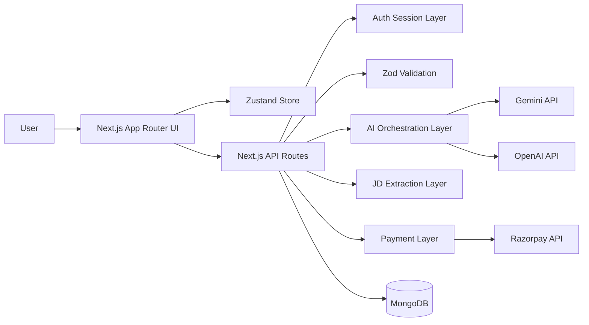

# Architecture

## Objective

AI Resume Optimizer is designed as a modular full-stack application that separates:
- client presentation
- domain state
- server-side orchestration
- external integrations
- persistence

The current implementation is intentionally structured to support later additions such as persistent resume storage, production billing hardening, richer analytics, and multi-provider AI routing.

## Architectural Principles

### 1. Keep domain types shared
Shared business types live under `types/` and are reused across UI, store, API handlers, and server orchestration.

### 2. Validate at boundaries
User input is validated with Zod in the client and server request layers before any deeper processing occurs.

### 3. Keep AI orchestration isolated
AI-provider selection, response parsing, schema validation, and normalization are isolated under `lib/server/` so the rest of the app does not depend on provider-specific logic.

### 4. Separate route protection from business logic
Authentication and subscription checks are enforced through dedicated auth/session helpers instead of being scattered through UI components.

### 5. Prefer replaceable integrations
MongoDB, Gemini, OpenAI, and Razorpay all sit behind thin integration modules so later providers or backend changes can be swapped in with limited surface-area changes.

## Top-Level Architecture

## Runtime Building Blocks

### Client Layer
- Route pages under `app/(routes)/`
- Feature components under `components/`
- React Hook Form for builder, auth, and analyze forms
- Zustand for cross-page state like resume content, analysis results, uploaded file metadata, and optimization suggestions

### API Layer
- Route handlers under `app/api/`
- Handles authentication, AI calls, job-description extraction, and subscription/payment actions
- Returns JSON responses tailored to the client service layer

### Domain Layer
- Shared types under `types/`
- Shared schemas and transformers under `utils/`
- No database schema library is used yet; MongoDB collections are managed directly via server utilities

### Persistence Layer
- MongoDB stores users and payment records
- Subscription state is embedded inside the user document
- Session state is not stored in the database; it is reconstructed from signed cookie tokens plus a user lookup

### External Services
- Gemini is the current default AI provider
- OpenAI remains as a supported alternate provider
- Razorpay is the payment provider integration target
- Vercel hosts the application runtime

## Directory Responsibilities

| Directory | Responsibility |
| --- | --- |
| `app/` | Layouts, route pages, and API route handlers |
| `components/` | UI building blocks and feature composition |
| `hooks/` | Auth session sync, mounted state, and toast convenience hooks |
| `lib/server/` | Auth, MongoDB, AI orchestration, JD extraction, and payment integrations |
| `lib/services/` | Client-side service wrappers for calling API routes |
| `store/` | Central Zustand application state |
| `types/` | Shared domain contracts |
| `utils/` | Zod schemas, transformers, PDF helpers, and pure utilities |
| `docs/` | Technical project documentation |

## Core Runtime Flows

### Analyze Flow
1. User uploads a PDF and enters JD text or a job URL.
2. Client extracts PDF text when possible.
3. Client calls `POST /api/analyze`.
4. Server validates payload, checks auth/subscription, resolves JD text, and calls the AI layer.
5. Server returns structured analysis data.
6. UI stores the result in Zustand and renders the dashboard.

### Optimize Flow
1. User creates or edits resume content in the builder.
2. User runs general or JD-aligned optimization.
3. Client calls `POST /api/optimize` with structured `resumeData`.
4. Server validates payload, resolves JD input, and calls live AI optimization.
5. UI renders section-based suggestions and can apply mapped suggestions back into the builder state.

### Auth And Billing Flow
1. User signs up or logs in.
2. Server creates a signed HTTP-only cookie.
3. Protected routes require authentication and, where applicable, active subscription state.
4. Billing page either starts Razorpay checkout or activates a plan directly in bypass mode.
5. Verified subscription data is written into MongoDB and reflected in subsequent route-access decisions.

## Extension Points

### Easy Next Steps
- Persist resume builder content per authenticated user
- Add background usage tracking or analytics
- Add AI request logging and cost dashboards
- Add additional AI providers without changing client contracts
- Add webhook-based payment confirmation

### Current Architectural Gaps
- No persistent resume document model yet
- No audit/event stream for AI requests or billing actions
- No automated test harness in the repository yet
- No queue or async job system for large document parsing

## Related Documents

- [High-Level Design](./HLD.md)
- [Low-Level Design](./LLD.md)
- [Diagram Pack](./DIAGRAMS.md)
