# Diagram Pack

This file centralizes the main diagrams for reviews, demos, onboarding, and interviews.

## 1. System Context Diagram

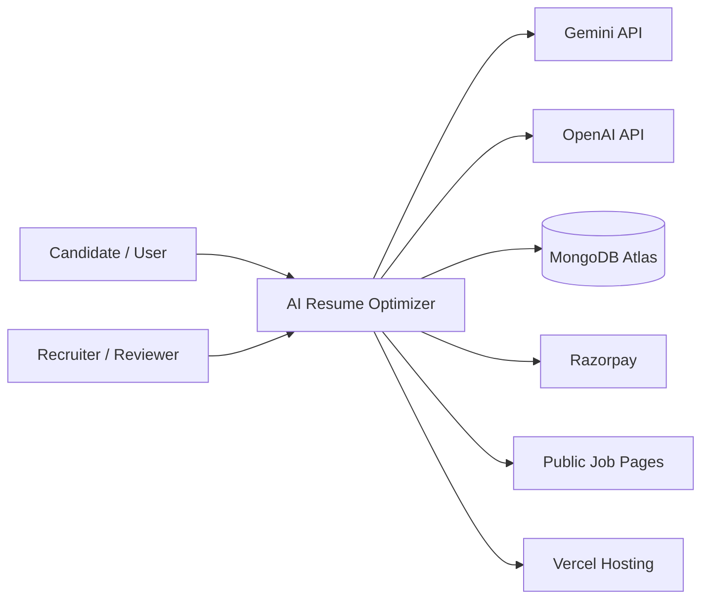

## 2. HLD Container Diagram

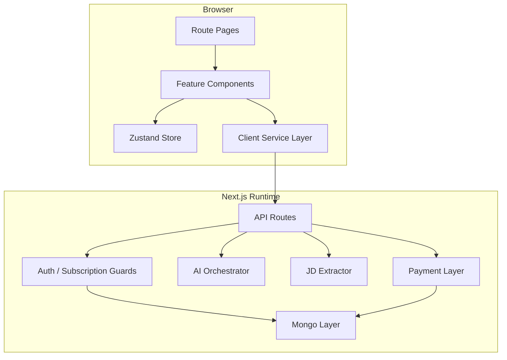

## 3. LLD Module Interaction Diagram

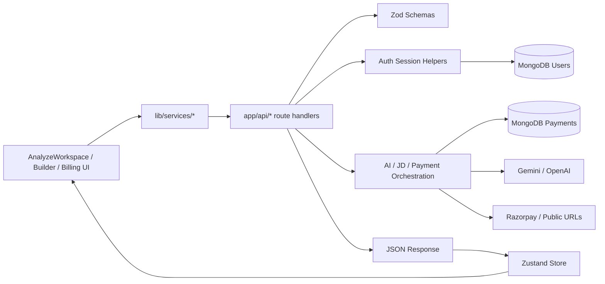

## 4. Class Diagram

This is a domain-and-service class diagram, not a literal representation of only `class` keywords in the code.

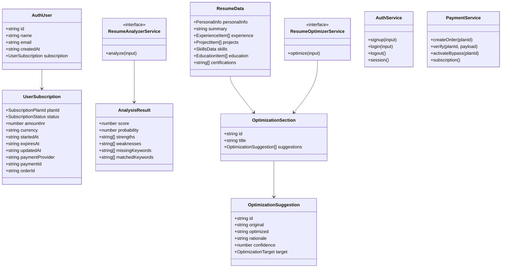

## 5. ER Diagram

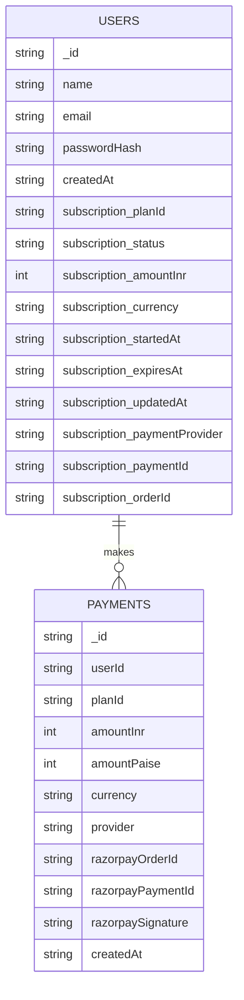

## 6. Signup And Login Sequence

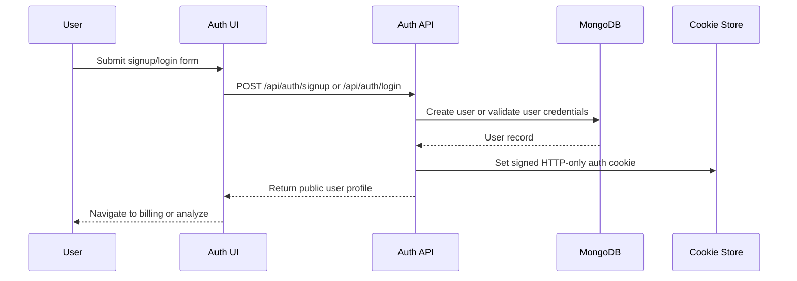

## 7. Analyze Sequence

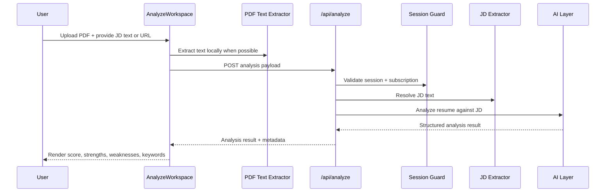

## 8. Optimize Sequence

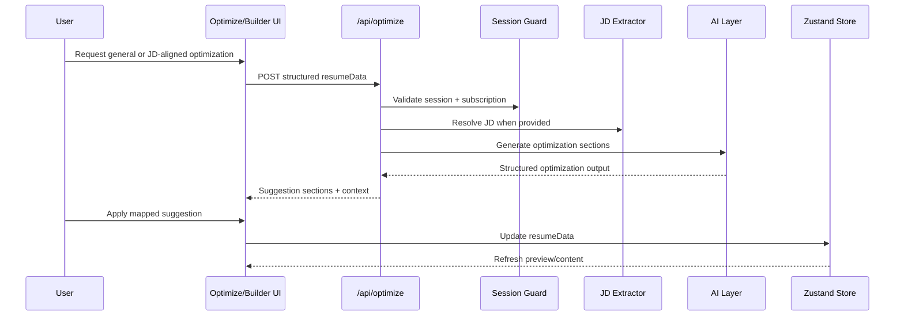

## 9. Billing Bypass Sequence

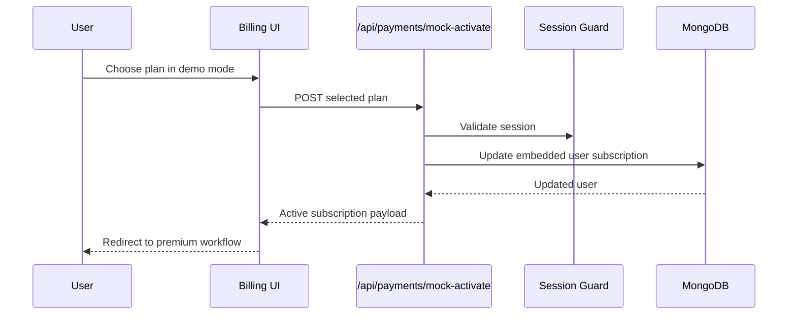

## 10. Billing Razorpay Sequence

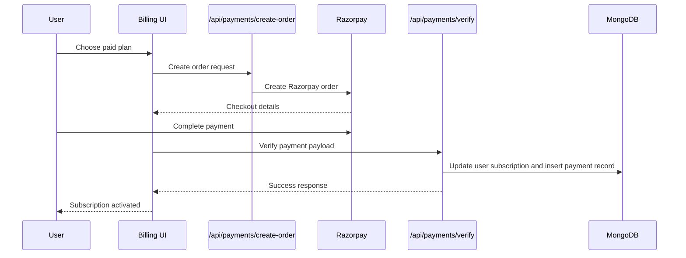

## 11. Deployment Diagram

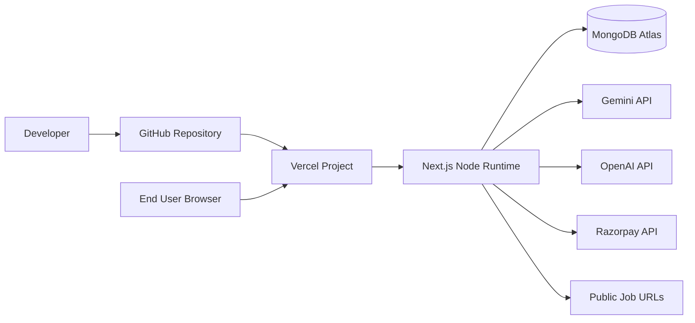
