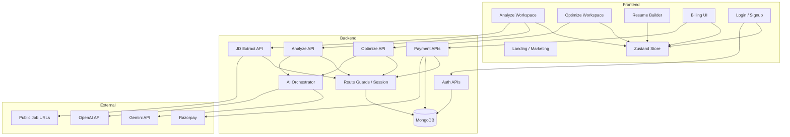
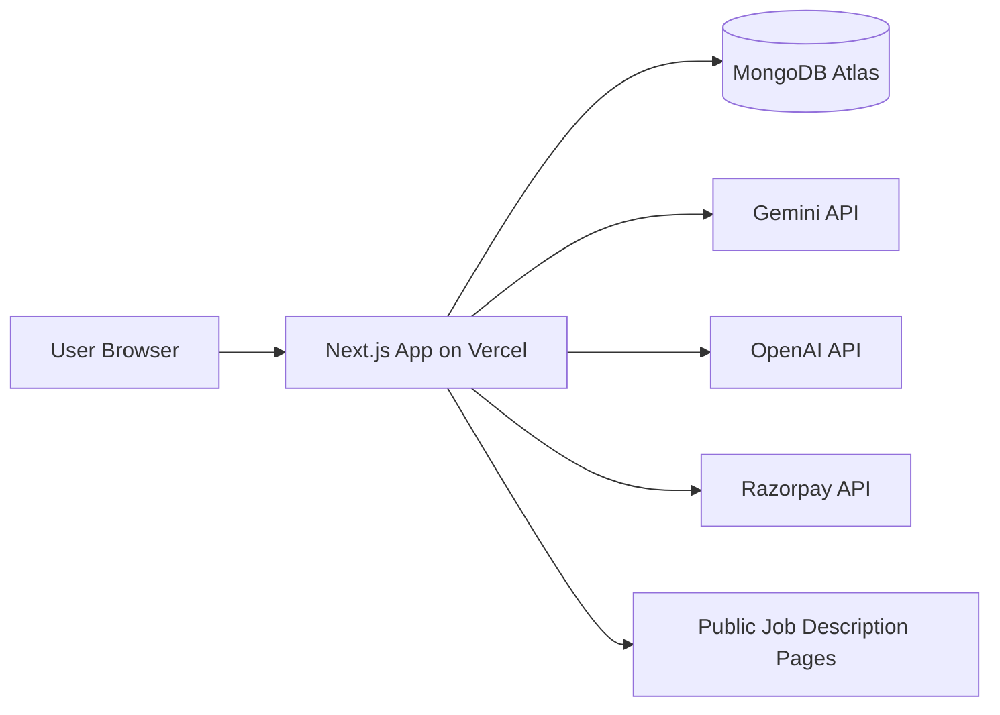

# High-Level Design

## Scope

AI Resume Optimizer is a web product for users who want to:
- assess resume fit against a specific role
- improve resume wording and keyword alignment
- create ATS-friendly resumes from scratch
- access premium optimization capabilities through subscription-gated flows

## Functional Domains

### 1. Resume Analysis
Accept a resume file and JD input, then return ATS-focused analysis output.

### 2. Resume Optimization
Use structured resume content and optional JD context to generate AI-backed improvements.

### 3. Resume Builder
Offer a structured editor and real-time ATS-friendly preview.

### 4. Identity And Access
Provide account creation, login, session restoration, and protected-route behavior.

### 5. Subscription And Billing
Track plan eligibility, allow subscription activation, and gate premium routes.

## High-Level Component View

## Deployment View

## Non-Functional Goals

### Scalability
- Modular directory structure
- Clear separation between UI, API, persistence, and integrations
- Provider-switchable AI layer

### Maintainability
- Shared domain types
- Zod validation at request boundaries
- Thin service wrappers for API access
- Isolated payment, auth, and AI modules

### Security
- Secure HTTP-only auth cookies
- Server-side session verification
- MongoDB-backed user persistence
- Signature verification for real Razorpay payment confirmation

### User Experience
- Responsive layouts
- Dark mode support
- Toast feedback
- Loading skeletons and progress feedback
- ATS-friendly print output

## System Boundaries

### In Scope Today
- Resume analysis
- Resume optimization
- Resume builder
- Auth and subscription gating
- MongoDB persistence for users and payments
- Vercel deployment

### Out Of Scope Today
- Persistent resume storage
- Team collaboration
- Webhooks and asynchronous jobs
- Usage metering dashboards
- Admin console
- Automated test suite

## Risks And Mitigations

| Risk | Impact | Current Mitigation |
| --- | --- | --- |
| AI output shape variance | Broken UI contracts | Zod validation plus response normalization |
| Job pages block scraping | Missing JD content | Support manual JD paste fallback |
| Payment gateway not configured | Billing confusion | Explicit bypass mode and billing messaging |
| Session/user drift | Stale access state | Session rebuilt from signed cookie plus DB lookup |
| External API instability | Feature degradation | Analysis fallback and explicit optimize failure messaging |

## Traceability To Code

- UI routes: `app/(routes)/`
- API routes: `app/api/`
- AI orchestration: `lib/server/ai-json.ts`, `lib/server/resume-ai.ts`
- Auth: `lib/server/auth/`
- MongoDB: `lib/server/mongodb.ts`
- Payments: `lib/server/payments/`
- Store: `store/use-resume-store.ts`
