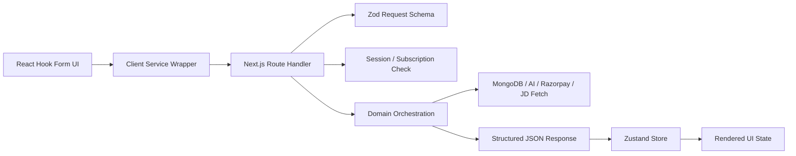

# Low-Level Design

## Purpose

This document describes how the current implementation is composed at module level, how data moves across layers, and where critical logic lives.

## Module Map

| Layer | Key Files | Responsibility |
| --- | --- | --- |
| Route Pages | `app/(routes)/*/page.tsx` | Render top-level screens |
| Feature Components | `components/resume/*`, `components/auth/*`, `components/billing/*` | Forms, previews, results, and actions |
| Client Services | `lib/services/*.ts` | Typed fetch wrappers for APIs |
| Global Store | `store/use-resume-store.ts` | Cross-page analysis, resume, and optimization state |
| Validation | `utils/*.ts` | Zod schemas, transformations, and helpers |
| Server APIs | `app/api/**/route.ts` | Request validation, session checks, orchestration |
| Server Integrations | `lib/server/**` | Auth, MongoDB, AI providers, JD extraction, payments |
| Shared Types | `types/*.ts` | Domain contracts reused across layers |

## LLD Module Interaction

## Client-Side Design

### Analyze Workspace
File: `components/resume/analyze-workspace.tsx`

Responsibilities:
- manage upload selection and JD input
- validate form input with `analyzeSchema`
- extract PDF text locally when possible
- call `resumeAnalyzerService.analyze`
- write returned job description, resume text, and analysis result into Zustand
- surface success/error/warning toasts

Notable detail:
- Uploaded files are not persisted to the backend; only metadata and extracted text are used.

### Optimization Workspace
File: `components/resume/optimization-sections.tsx`

Responsibilities:
- operate on existing `resumeData` from the builder store
- guard optimization until meaningful resume data exists
- call `resumeOptimizerService.optimize`
- render suggestion sections and apply mapped suggestions back into store state

Notable detail:
- if a suggestion has no trusted `target`, it is treated as a manual recommendation instead of being auto-applied.

### Resume Builder Workspace
File: `components/resume/resume-builder-workspace.tsx`

Responsibilities:
- manage structured form state for all resume sections
- derive preview data with `formValuesToResumeData`
- save builder state into Zustand
- request optimization against the live preview data
- apply selected optimization suggestions back into form state

### Billing UI
File: `components/billing/subscription-plans.tsx`

Responsibilities:
- fetch current subscription snapshot
- render plan cards
- launch real Razorpay checkout when enabled
- activate plans directly when bypass mode is enabled
- keep auth/session and billing state visually synchronized

## Global Store Design

File: `store/use-resume-store.ts`

State members:
- `uploadedFile`
- `jobDescription`
- `resumeText`
- `analysisResult`
- `resumeData`
- `optimizationSections`
- `optimizationContext`
- `isAnalyzing`

Actions:
- setters for each top-level state slice
- `setOptimizationSections`
- `applySuggestionToResume`
- `resetAnalysis`

Design choice:
- resume builder state is intentionally client-side for now, which keeps the MVP fast but means builder content is not durable across devices or sessions.

## Server-Side Design

### Auth Subsystem
Files:
- `lib/server/auth/session.ts`
- `lib/server/auth/session-token.ts`
- `lib/server/auth/user-store.ts`
- `lib/server/auth/guards.ts`
- `lib/server/auth/password.ts`

Responsibilities:
- hash and verify passwords
- build and verify signed session tokens
- store and retrieve users from MongoDB
- enforce auth and subscription-aware redirects

Implementation notes:
- session tokens live in secure HTTP-only cookies
- sessions are stateless at storage level and reconstructed from cookie payload plus DB lookup
- users are normalized before being returned to the client

### AI Orchestration
Files:
- `lib/server/ai-json.ts`
- `lib/server/resume-ai.ts`

Responsibilities:
- select AI provider based on environment
- issue structured generation requests
- normalize provider output before Zod validation
- return AI-backed or fallback analysis responses
- require live AI success for optimization output

Implementation notes:
- Gemini can receive a JSON schema through `responseJsonSchema`
- output normalization handles mismatched percentages, category aliases, and imperfect optimization targets
- optimization suggestions are cleaned rather than discarded wholesale when a subset of targets is invalid

### JD Extraction
File: `lib/server/jd-extractor.ts`

Responsibilities:
- detect whether user input is raw text or a URL
- fetch public web pages with timeout control
- strip scripts/styles/HTML markup
- return clipped readable text for downstream AI processing

### Payment Subsystem
Files:
- `lib/server/payments/plans.ts`
- `lib/server/payments/razorpay.ts`
- `lib/server/payments/payment-store.ts`
- `lib/server/payments/config.ts`

Responsibilities:
- define subscription plans and expiry windows
- create Razorpay orders
- verify Razorpay signatures
- persist payment records
- toggle demo bypass mode from environment configuration

## Route-By-Route Behavior

### `POST /api/analyze`
1. Read session from cookie
2. Reject if unauthenticated or unsubscribed
3. Validate request body with `analyzeApiRequestSchema`
4. Resolve JD text via `resolveJobDescription`
5. Call `analyzeResumeWithAI`
6. Return analysis result, JD source, and optional warning

### `POST /api/optimize`
1. Read session from cookie
2. Reject if unauthenticated or unsubscribed
3. Validate request body with `optimizeApiRequestSchema`
4. Resolve JD text when provided
5. Call `optimizeResumeWithAI`
6. Return optimization sections plus context metadata

### `POST /api/auth/signup`
1. Validate request body with `signupSchema`
2. Reject duplicate email
3. Hash password
4. Create user in MongoDB with default inactive subscription
5. Set auth cookie and return public user

### `POST /api/auth/login`
1. Validate request body with `loginSchema`
2. Find user by email
3. Verify password hash
4. Set auth cookie and return public user

### `GET /api/payments/subscription`
1. Read session
2. Return active subscription snapshot and plan list
3. Expose whether payment bypass mode is enabled

### `POST /api/payments/mock-activate`
1. Require bypass mode enabled
2. Read session
3. Validate selected plan
4. Compute subscription expiry
5. Update embedded user subscription in MongoDB

### `POST /api/payments/verify`
1. Read session
2. Validate request payload
3. Verify Razorpay signature
4. Prevent duplicate payment processing
5. Update subscription in user document
6. Insert immutable payment record

## Validation Strategy

### Client-Side Validation
- `utils/schemas.ts` validates form UX
- React Hook Form uses Zod resolvers for immediate feedback

### Server-Side Validation
- `utils/api-schemas.ts`, `utils/auth-schemas.ts`, and `utils/payment-schemas.ts` validate request payloads at API boundaries
- server routes never trust client-side validation alone

## Error Handling Strategy

- API routes return JSON `{ message }` on failure
- client service wrappers convert non-OK responses into thrown `Error`
- UI components surface failures using toast notifications
- analysis can degrade to fallback output
- optimization intentionally fails closed when live AI is unavailable

## Persistence Boundaries

Persisted in MongoDB:
- users
- embedded subscription data
- payment records

Not yet persisted:
- builder resume content
- uploaded PDF files
- AI analysis history
- optimization history

## Maintainability Notes

Good current choices:
- shared type system
- integration isolation
- route-level validation
- modular folder layout

Likely next refactors:
- move payment and AI orchestration into separate domain services
- persist resume documents as first-class records
- add repository abstractions for Mongo collections
- add automated test coverage for route handlers and normalization logic
